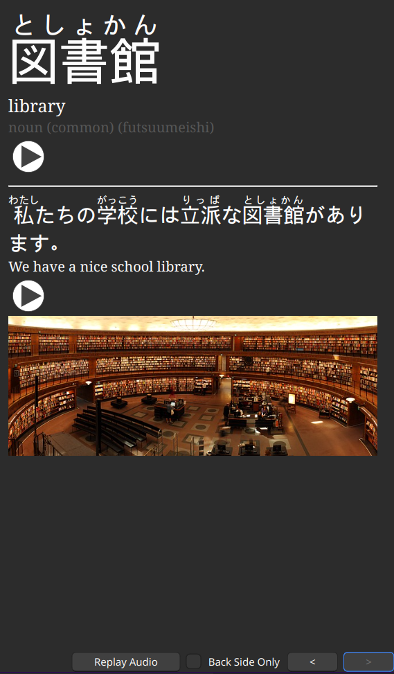
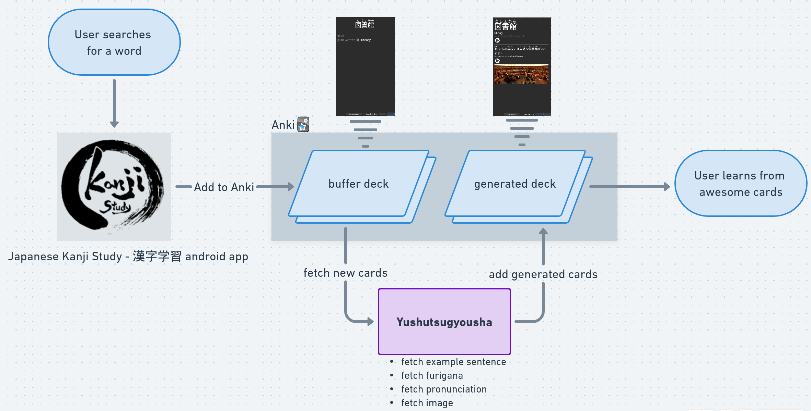

# Yushutsugyousha - Anki Japanese exporter

Automatically fetch meaning, furigana, example sentence, pronunciation, and image for a Japanese word or phrase and export it as a card to Anki. Ideal for busy Japanese learners.

For example:

### Input: 図書館

### Output:

Generated card in Anki:\
 

The inspiration came from this [Reddit post](https://www.reddit.com/r/ChineseLanguage/comments/7mjmjc/best_anki_deck_for_hsk_ive_come_across/) and the Chinese HSK deck the OP mentions in it.

## How it works / credits

- Looks up word in [JMDict](https://www.edrdg.org/jmdict/j_jmdict.html), now we have the meaning and an example sentence (from [Tanaka Corpus
  ](https://www.edrdg.org/wiki/index.php/Tanaka_Corpus))
- Converts word and from [kuroshiro](https://github.com/hexenq/kuroshiro) with the [kuromoji analyzer](https://github.com/hexenq/kuroshiro-analyzer-kuromoji)
- Fetches pronunciation voice from [TTSMP3.com](https://ttsmp3.com/)
- Fetches an image for the word from [Pixabay](https://pixabay.com)

## Anki Setup

- Install [Anki desktop](https://apps.ankiweb.net/)

- Add [Anki-Connect](https://foosoft.net/projects/anki-connect/index.html#model-actions) to Anki

- Create a new deck in Anki for the generated cards (set the `DECK_NAME` environment variable)
- Create a new Note Type (aka Model) with the following fields:
  - `Word`
    - Noto Serif 20
    - Sort by this field in thr browser
  - `Furigana`
    - Noto Serif 20
  - `Meaning`
    - Liberation Sans 12
  - `Part of speech`
    - Liberation Sans 12
  - `Audio`
    - Liberation Sans 12
  - `Sentence`
    - Noto Serif 20
  - `SentenceFurigana`
    - Noto Serif 20
  - `SentenceMeaning`
    - Liberation Sans 12
  - `SentenceAudio`
    - Liberation Sans 12
  - `Image`
    - Liberation Sans 12
  - Now we needed to add a new card to the deck (could be anything) in order to modify the cart type in the Browse window
  - Add Front Template to the card type
    ```html
    <div class="kanji">{{Word}}</div>
    <div class="furigana"><br /></div>
    <div class="english"><br /></div>
    <div class="description"><br /></div>
    <hr />
    <div class="sentence">{{Sentence}}</div>
    ```
  - Add Back Template to the card type
    ```html
    <div class="kanji">{{Furigana}}</div>
    <div class="english">{{Meaning}}</div>
    <div class="description">{{Part of speech}}</div>
    {{Audio}}
    <hr />
    <div class="sentence">{{SentenceFurigana}}</div>
    <div class="meaningSent">{{SentenceMeaning}}</div>
    {{SentenceAudio}}
    <br />
    {{Image}}
    ```
  - And finally some styling
    ```css
    .card {font-family: arial; font-size: 10px; text-align: left; #222222; background-color: #fdf6e3;}
    .kanji {font-family: Kaiti; font-size: min(calc(10vw + 12px),68px);}
    .sentence{font-family: SimSun; font-size:24px; text-align:left}
    .english{font-family: Georgia; font-size: 20px;}
    .meaningSent{font-family: Georgia; font-size: 16px; text-align:left}
    .description{font-family: Georgia; font-size: 16px; color: #575757;}
    hr{margin-top: 1em; margin-bottom: 1em;}
    ```
  - Set the `MODEL_NAME` environment variable to the new model's name

## Exporter app setup

- Install nodejs, npm
- Clone this git repo
- Run `npm install`
- Create a `.env` file and set the following environment variables
  - `PIXABAY_API_KEY` (you need a pixabay api key)
  - `DECK_NAME` (the generated cards will be added to this deck)
  - `MODEL_NAME` (the name of the )
- Download `JMdict_e_examp.gz` from [here](http://www.edrdg.org/wiki/index.php/JMdict-EDICT_Dictionary_Project#CURRENT_VERSION_&_DOWNLOAD)
- Unzip the file (`gzip -d JMdict_e_examp.gz`) and move to `/path/to/cloned-repo/static`
- Run `npm run xml-to-json`
- Start Anki desktop
- Run the app with `npm run build && npm run start` or in dev mode with `npm run start`

## Usage

Call the REST api to add a new card for a word, e.g. `curl -X POST "localhost:8764/図書館"`

- it's recommended to provide the actual Japanese word instead of the English meaning, this is not an English-Japanese dictionary but an Anki export tool (although I might a 0th step for Jisho E->J translation if an English word is added)

## Scanner functionality

My workflow is usually:

- I lookup a word in the [Japanese Kanji Study - 漢字学習 android app](https://play.google.com/store/apps/details?id=com.mindtwisted.kanjistudy&hl=en&gl=US)
- (Optional: add the kanjis to custom sets to learn them later)
- Click on the "Add to Anki" icon in the top of the word's page and add it to a _buffer deck_.
  - This has nothing to do with Yushutsugyousha the exporter / the generated deck, it's a basic functionality for a lot of apps.
  - I have a separate deck for these in-app export cards, I call it a _buffer deck_, because we use it as a buffer: learning apps add raw cards to it, and the Yushutsugyousha exporter will read its content and generate a new cards to its own deck.

The Yushutsugyousha exporter periodically checks the buffer deck for new cards and generates a card with example sentence, image, and audio to it's own deck.



To enable it you need to set the `SCANNER` environment variable to `true` and `BUFFER_DECK_NAME` to the buffer deck's name. Optionally you can set the `SCAN_INTERVAL_MS` to a custom value, the default is 60 \* 1000 ms = 1 minute.
